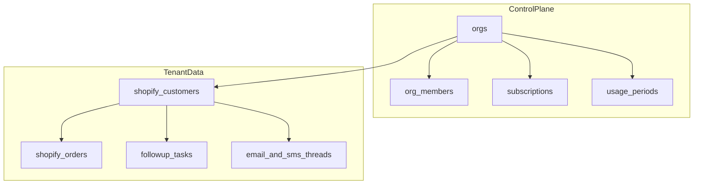
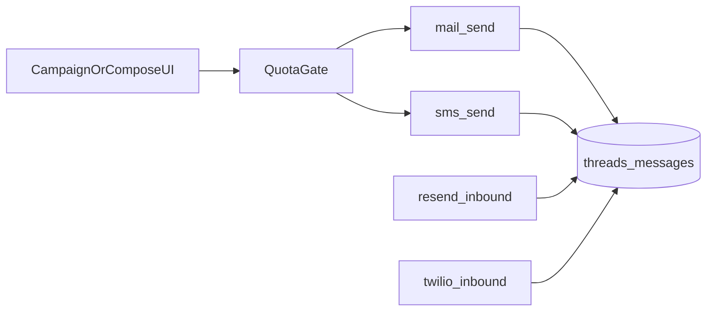

# New SaaS — architecture (separate project)

Greenfield commercial product. **Not** a fork of [`cge-webapp`](../).  
Repo (scaffold): [`cge-saas/`](../../cge-saas/).  
Pricing: [`SAAS-PRICING-AND-WORKFLOW.md`](./SAAS-PRICING-AND-WORKFLOW.md).  
Patterns: [`DATAPULSEFLOW-PATTERNS-REVIEW.md`](./DATAPULSEFLOW-PATTERNS-REVIEW.md) (includes full `Datapulse/` vendor review).

Working brand in scaffold: **cge.** / Customer Growth Engine (rename when product name is final).

---

## Goals

- Multi-tenant SaaS: org signup → Stripe plan → Shopify connect → unlimited CGEs
- Plans: Starter £229 / Growth £399 / Pro £599 with email + SMS quotas
- Shopify data via DataPulseFlow integration kit patterns
- Follow-up queue + soft email + marketing email (Resend) + marketing SMS (Twilio UK, two-way)
- Hard quota enforcement; SMS packs for overage

## Non-goals

- Converting Unique Distribution CGE into multi-tenant SaaS
- Unlimited SMS
- Forking Datapulse user-scoped access-code model as org tenancy

---

## Design system (from UI/UX reference)

Landing and marketing chrome follow the provided corporate reference:

| Token | Value | Use |
|-------|-------|-----|
| Primary navy | `#001A72` | Stats bar, logo, primary text |
| Accent cyan | `#00ADEF` | CTAs, highlights |
| Surface | `#FFFFFF` | Header / top bar |
| Typeface | **Neue Haas Grotesk** | All UI (Display/Bold headlines; Regular body) |

Layout pattern: top contact bar → nav (logo left, links + cyan CTA) → **full-bleed hero** (headline, one supporting line, one CTA) → deep navy **stats strip**. App shell reuses the same tokens (no purple-on-white defaults).

---

## Recommended stack

| Concern | Choice | Borrowed from |
|---------|--------|----------------|
| App | Vite + React + TypeScript + TanStack Query + shadcn | `Datapulse/`, CGE |
| Backend | Supabase (Auth, Postgres, RLS, Edge Functions) | Datapulse |
| Billing | **Stripe** Checkout + Customer Portal + **webhooks** | Datapulse checkout shape; webhook discipline from Paystack fulfillment |
| Email | **Resend** | Datapulse `send-email` + CGE campaigns/inbound |
| SMS | **Twilio** UK long code / Messaging Service | New |
| Shopify | DataPulseFlow kit (`shopify-sync` / `shopify-webhook`) | kit |

---

## Tenancy model

**Default: single Supabase project, shared schema, `org_id` on all tenant rows.**

Datapulse uses `user_id` only — **do not copy that**. Adapt its signup trigger idea:

`handle_new_user` → create `orgs` row + `org_members` (owner) + trial `subscriptions` / `usage_periods`.



| Table (conceptual) | Purpose |
|--------------------|---------|
| `orgs` | Tenant; Twilio from-number; Resend from domain |
| `org_members` | user_id ↔ org_id ↔ role (`owner`, `admin`, `cge`) |
| `subscriptions` | Stripe customer/subscription/price; plan slug |
| `usage_periods` | period_start/end; email_sent; sms_segments; caps |
| `sms_credit_packs` | purchased pack balance |
| `message_suppressions` | email + phone STOP/bounce |
| `shopify_*` + CGE-like tables | All scoped by `org_id` |
| `platform_settings` | Non-secret KV (like Datapulse `admin_settings`) |

RLS: member can only access their `org_id`. Platform `super_admin` optional (Datapulse `admin` analogue).

---

## Billing (vs Datapulse)

| Datapulse | New SaaS |
|-----------|----------|
| Access codes lock dashboard | Stripe `active` / `trialing` unlocks product |
| Optional PayPal/Paystack | **Stripe-first** (GBP plans) |
| No Stripe webhook | **Required** `stripe-webhook` → update `subscriptions` + reset/create `usage_periods` |
| Secrets in `admin_settings` | Env / Vault only |

Plans map to Stripe Price IDs (Starter / Growth / Pro + SMS packs).

---

## Quotas

| Plan | Email / mo | SMS / mo |
|------|------------|----------|
| starter | 10,000 | 1,000 |
| growth | 25,000 | 2,500 |
| pro | 45,000 | 5,000 |

Send path: resolve org from JWT → load subscription + usage → 403 `quota_exceeded` if over → else send and increment.

---

## Messaging architecture



Device `sms:` links are **not** the commercial path.

---

## Shopify / DataPulseFlow

- Kit functions on the platform project; credentials **per org**.
- Webhook URL identifies tenant (query/path + per-org HMAC).
- Product Stripe subscription is orthogonal to any DataPulseFlow license code for sync.

---

## App modules (MVP)

1. Marketing landing (UI reference) + auth  
2. Org create / invite CGEs  
3. Stripe billing + usage dashboard  
4. Shopify connect + sync health  
5. Follow-up queue + customer detail  
6. Email templates + campaigns + inbox  
7. SMS templates + campaigns + inbox + STOP  

Reference behavior: queue/campaigns from `cge-webapp`; sync ops UX from `uddash-main`; billing shell ideas from `Datapulse/` (not schema).

---

## Repo layout

```
cge-saas/
  src/
    pages/           # Landing, auth, app routes
    components/landing/
    styles/          # design tokens + Neue Haas Grotesk
  public/fonts/      # licensed Neue Haas Grotesk files (optional)
  supabase/
    migrations/
    functions/
      stripe-webhook/
      mail-send/
      mail-inbound/
      campaign-send/
      sms-send/
      sms-inbound/
      shopify-webhook/
      shopify-sync/
  docs/
```

---

## Implementation order

1. ~~UI reference~~ — received; landing scaffolded in `cge-saas`
2. Supabase project + `orgs` / members / RLS  
3. Stripe plans + webhook → subscriptions + usage  
4. Embed/adapt DataPulseFlow kit with `org_id`  
5. Port CGE queue + customer UX  
6. Resend + quotas  
7. Twilio SMS + inbound + packs  
8. Usage UI  

---

## Open inputs

- Final product name / domain  
- Stripe account + GBP price IDs  
- Twilio UK number (buy vs port)  
- Resend domain for SaaS brand  
- Licensed Neue Haas Grotesk font files (CDN used for scaffold preview)  
- DataPulseFlow multi-tenant licensing if kit is embedded commercially  
