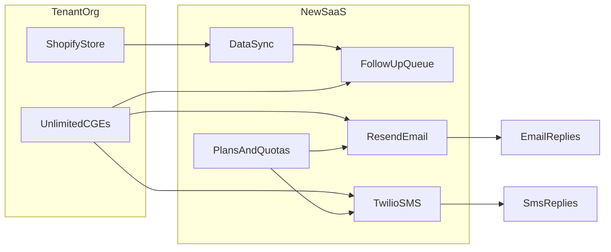
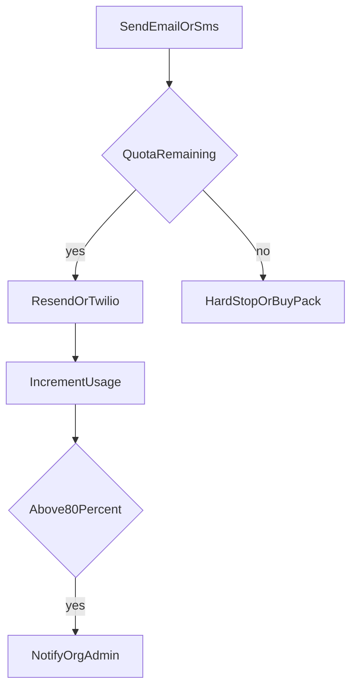

# SaaS pricing and workflow

Commercial packaging for a **new separate product** (not a fork of this CGE webapp).  
CGE remains a **reference implementation** for follow-up queue, soft email, campaigns, and Resend reply threading.  
DataPulseFlow remains the **blueprint** for Shopify sync / multi-tenant SaaS operations.

Billing currency: **GBP**. Provider markups tracked in **USD** as below.

---

## 1. Cost model

| Provider | Your cost | Markup | Client-facing block |
|----------|-----------|--------|---------------------|
| **Resend** (email) | **$20**/mo plan | **+$75** flat | **$95** (~£75) baked into every plan |
| **Twilio SMS** (UK) | ~**£0.05**/SMS (~$0.065) carrier | **+$75** flat per plan SMS allotment | SMS block = carrier cost + $75 |

- **CGEs:** unlimited on all plans (no seat metering).
- **Email:** Resend $20 is enough for the stated caps (10k / 25k / up to 45k).
- **SMS:** never sell “unlimited”; enforce caps + packs.
- **UK sending:** Twilio **UK long code** (or ported UK number) for **two-way** SMS. Alphanumeric sender IDs are one-way only (no replies in-app).

### SMS cost sketch (at £0.05/SMS)

| Included SMS | Carrier cost | + $75 markup (~£60) | SMS block ≈ |
|--------------|--------------|---------------------|-------------|
| 1,000 | £50 | +£60 | ~£110 |
| 2,500 | £125 | +£60 | ~£185 |
| 5,000 | £250 | +£60 | ~£310 |

---

## 2. Launch plans

| | **Starter** | **Growth** | **Pro** |
|--|-------------|------------|---------|
| **Price** | **£229/mo** | **£399/mo** | **£599/mo** |
| **CGEs** | Unlimited | Unlimited | Unlimited |
| **Email** | **10,000**/mo | **25,000**/mo | **Up to 45,000**/mo |
| **SMS** | **1,000**/mo | **2,500**/mo | **5,000**/mo |
| Soft email + follow-up queue + campaigns | Yes | Yes | Yes |
| SMS campaigns + inbound replies in-app | Yes | Yes | Yes |

### Pitch line

> **£229** — 10k email · 1k SMS · unlimited CGEs  
> **£399** — 25k email · 2.5k SMS  
> **£599** — up to 45k email · 5k SMS  

### Overage / packs

| Add-on | Price | Notes |
|--------|-------|--------|
| **1,000 SMS** pack | **£99** | ~2× carrier + buffer |
| **2,500 SMS** pack | **£229** | |
| **5,000 SMS** pack | **£429** | |
| Metered SMS | **£0.10**/SMS | Alternative to packs |
| Email over cap | **£5 / 10,000** | Cheap; Resend plan already covers volume |

Hard-stop or require pack purchase when SMS quota hits 0. Soft-warn at 80%.

---

## 3. Profit sketch (per client / month)

Assumptions: Resend **$20 ≈ £15**; SMS **£0.05** each; markups already inside plan price.

### If they use 100% of included SMS

| | Starter £229 | Growth £399 | Pro £599 |
|--|--------------|-------------|----------|
| Revenue | £229 | £399 | £599 |
| − Resend | £15 | £15 | £15 |
| − SMS | £50 | £125 | £250 |
| **Gross profit** | **~£164** | **~£259** | **~£334** |
| **Margin** | **~72%** | **~65%** | **~56%** |

### More realistic (partial SMS)

| SMS used | Starter | Growth | Pro |
|----------|---------|--------|-----|
| **50%** | ~£189 | ~£321 | ~£459 |
| **25%** | ~£201 | ~£353 | ~£521 |

Subtract ~**£10–30**/client for Twilio number + infra/support for a “netter” view — still healthy.

Email under-cap barely changes cost (Resend stays ~£15 on the $20 plan).

---

## 4. New product vs this CGE repo

| | **This repo (`cge-webapp`)** | **New SaaS product** |
|--|------------------------------|----------------------|
| Role | Working CGE / Unique Distribution CRM reference | Commercial multi-tenant product |
| Tenancy | Single-tenant (one Shopify / one org) | Multi-tenant (many orgs, plans, quotas) |
| Billing | Not commercialized here | Stripe + Starter/Growth/Pro |
| Sync | DataPulseFlow license settings + Shopify sync | Same *patterns* as DataPulseFlow, greenfield repo |
| Messaging | Resend live; SMS = device `sms:` today | Resend + Twilio UK with inbound webhooks |

**Non-goal:** do not convert `cge-webapp` into the multi-tenant commercial product. Build a **separate project/repo**.

---

## 5. Platform workflow

### 5.1 Tenant onboarding

1. Signup (org admin).
2. Choose plan (Starter / Growth / Pro) → Stripe subscription.
3. Connect Shopify (OAuth or Admin API token + webhooks).
4. Invite CGEs (unlimited seats; still audit who belongs to the org).
5. Provision messaging: Resend domain / from-address; Twilio UK number (buy or port).

### 5.2 Data sync (DataPulseFlow-style)

1. Webhooks + scheduled reconcile land customers/orders into the **tenant workspace**.
2. Ownership labels (`sp_assigned` / `referred_by`) drive CGE visibility.
3. RFM / quiet-days / follow-up tasks refresh from order activity (related-account aware where needed).

### 5.3 Follow-up queue + soft email

1. Open tasks for VIP inactive, one-time lapsed, lapsed repeat, never purchased.
2. Soft prevention emails (day 60/75) via Resend — counts against **email quota**.
3. CGEs work the queue (call / WhatsApp / SMS / email); log outreach.

### 5.4 Marketing email campaigns

1. Audience presets (segment, quiet days, etc.) + HTML templates.
2. Send via Resend (`campaign-send` style batching).
3. Delivery/bounce/complaint webhooks → suppressions.
4. Inbound replies (plus-address or from-match) → threads on customer timeline.
5. Each send increments **email usage** for the billing period.

### 5.5 Marketing SMS campaigns (UK)

1. Templates kept short (avoid multi-segment bills); include opt-out language.
2. Send via Twilio from **UK long code** / Messaging Service.
3. Inbound webhook → match E.164 phone → customer → SMS thread (same UX idea as email threads).
4. `STOP` / unsubscribe → suppression list (mirror email suppressions).
5. Each segment sent increments **SMS usage**.

### 5.6 Quota enforcement

- Reset counters on billing period boundary (calendar month or Stripe period).
- Show usage in-app: email sent / cap, SMS sent / cap, packs remaining.

### 5.7 Billing lifecycle

1. Stripe Checkout / Customer Portal for plan changes.
2. Upgrade: immediate higher caps; prorate as Stripe default.
3. Downgrade: at period end; clamp usage display to new caps.
4. Past due: read-only or block sends (keep sync optional).
5. Cancel: retain data per retention policy; revoke API/send keys.

---

## 6. Provider checklist (ops)

### Resend
- [ ] Shared or per-tenant from-domain
- [ ] Inbound subdomain + webhook (reply threads)
- [ ] Bounce/complaint webhook → suppressions
- [ ] $20 plan covers launch caps

### Twilio (UK)
- [ ] UK long code or ported number
- [ ] Messaging Service
- [ ] Status callbacks + inbound SMS webhook
- [ ] STOP handling + suppression sync
- [ ] Budget alert at expected £200–400 for ~5k SMS months

### Compliance (UK SMS / email)
- [ ] Consent / legitimate interest documented for trade outreach
- [ ] Clear identity + opt-out on SMS
- [ ] Honour STOP immediately
- [ ] PECR / GDPR process for marketing lists

---

## 7. Build phases (separate product)

| Phase | Status | Deliverable |
|-------|--------|-------------|
| **1. This doc** | Done in-repo | Pricing + workflow |
| **2. DataPulseFlow review** | When full SaaS codebase is provided | Tenancy / license / billing patterns |
| **3. Architecture** | After (2) | New-repo stack, schema, quotas, Stripe |
| **4. UI/UX + build** | After UI reference | Scaffold + implement greenfield app |

See also:

- [`DATAPULSEFLOW-PATTERNS-REVIEW.md`](./DATAPULSEFLOW-PATTERNS-REVIEW.md) — patterns from the integration kit + uddash reference  
- [`NEW-SAAS-ARCHITECTURE.md`](./NEW-SAAS-ARCHITECTURE.md) — draft architecture for the separate repo  
- [`NEW-SAAS-NEXT-STEPS.md`](./NEW-SAAS-NEXT-STEPS.md) — UI/UX gate and pre-sprint checklist  

---

## 8. Revision log

| Date | Change |
|------|--------|
| 2026-08-12 | Initial launch card: £229 / £399 / £599; $20+$75 Resend; SMS+$75; unlimited CGEs; email 10k/25k/45k; SMS 1k/2.5k/5k |
